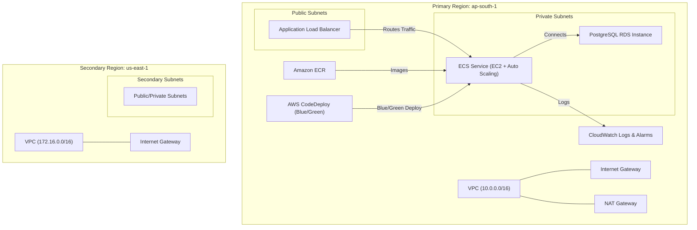
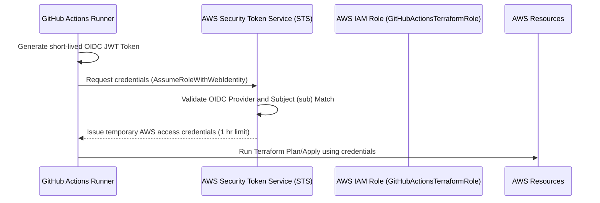
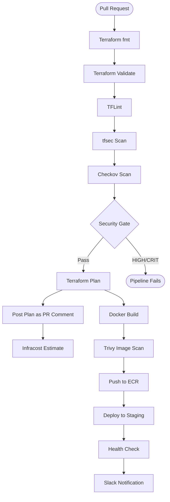
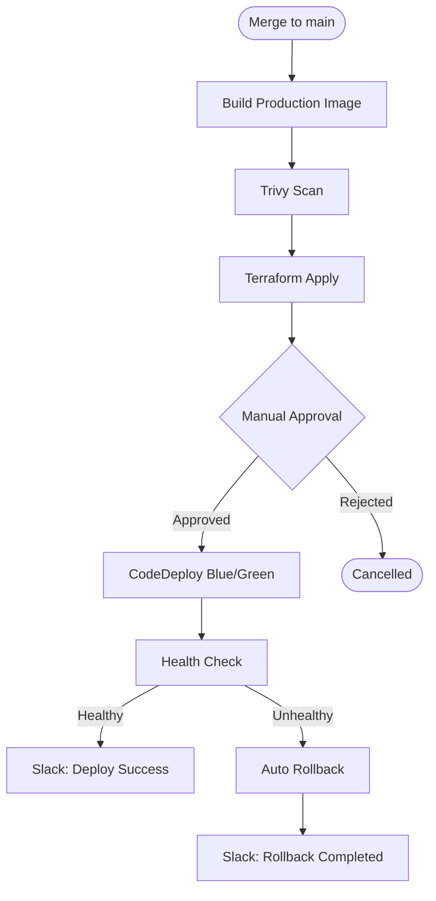

# Multi-Region AWS Infrastructure with Terraform & GitHub Actions CI/CD

An interview-ready, production-inspired Terraform codebase that provisions a secure, highly-available web application infrastructure on AWS. This repository demonstrates modern DevOps practices including GitOps CI/CD pipelines, OIDC federation, static code analysis (security/formatting), and multi-region network architectures.

---

## 🏗️ Architecture Overview

The infrastructure deploys a containerized web application tier using ECS on EC2, balanced with an Application Load Balancer, backed by a PostgreSQL database in RDS, and isolated within custom VPC subnets. Blue/Green deployments are managed by AWS CodeDeploy with automatic rollback.



---

## 🔒 Security Architecture & OIDC Flow

Instead of storing static AWS credentials in GitHub (which poses severe security risks), this repository uses **OpenID Connect (OIDC)** to dynamically assume temporary AWS IAM roles using short-lived JWT tokens.



### Key Security Implementations
1. **Zero Static Credentials**: Authentication to AWS is fully federated via OIDC.
2. **Automated Database Secrets**: Passwords are dynamically generated and stored in **AWS Secrets Manager**.
3. **Shift-Left Security Scanning**: tfsec, Checkov, TFLint, and Trivy run on every pull request.
4. **Pipeline Security Gate**: Pipeline fails on HIGH or CRITICAL severity findings.

---

## 🌐 Multi-Region Strategy

* **Primary Region (`ap-south-1`)**: Full application stack (Networking, ALB, ECS, RDS, CodeDeploy).
* **Secondary Region (`us-east-1`)**: Replicated network topology (VPC, subnets, route tables).
* **Cost Efficiency**: Secondary region configured with `enable_nat_gateway = false`.

---

## 🚀 CI/CD Pipeline

### CI Pipeline (Pull Request → Staging)



### CD Pipeline (Merge to Main → Production)



---

## 🔄 Blue/Green Deployment

ECS deployments use **AWS CodeDeploy** with automatic rollback:

| Setting | Value |
|---------|-------|
| Strategy | Blue/Green |
| Traffic Routing | All-at-once via ALB |
| Validation | Test listener on port 8443 |
| Rollback Trigger | Deployment failure or health check failure |
| Rollback Window | 5 minutes |
| Old Task Termination | 5 minutes after successful deployment |

---

## 📊 ECS Auto Scaling

| Parameter | Dev | Staging | Production |
|-----------|-----|---------|------------|
| Min Tasks | 1 | 2 | 2 |
| Max Tasks | 2 | 4 | 6 |
| CPU Target | 70% | 70% | 70% |
| Memory Target | 80% | 80% | 80% |
| Scale-Out Cooldown | 60s | 60s | 60s |
| Scale-In Cooldown | 300s | 300s | 300s |

---

## ⚙️ Configuration & Deploying

### 📂 Multi-Environment Structure

```
environments/
  ├── dev.tfvars      # Low-cost developer configurations
  ├── staging.tfvars   # Pre-production validation
  ├── test.tfvars      # Legacy test environment
  └── prod.tfvars      # Production high-availability setup
```

### 🗃️ State Segregation (Terraform Workspaces)

Each environment uses a **Terraform Workspace** to isolate state. S3 keys are automatically prefixed (e.g., `env:/dev/terraform-aws-multi-region/terraform.tfstate`).

```bash
# Initialize backend
terraform init

# Create and switch to workspace
terraform workspace new dev     # (Only once)
terraform workspace select dev  # (Subsequent runs)
```

### 📋 Running Environments Locally

```bash
# Developer Sandbox
terraform plan -var-file="environments/dev.tfvars"

# Staging Environment
terraform plan -var-file="environments/staging.tfvars"

# Production Environment
terraform plan -var-file="environments/prod.tfvars"
```

### 🚀 Running Environments in CI
1. **Pull Requests**: Automatically runs security scans, TFLint, terraform plan (with PR comment), Infracost estimate, Docker build + Trivy scan, and staging deployment.
2. **Manual Trigger (`workflow_dispatch`)**: Choose target environment from the Actions tab.
3. **Merge to Main**: Triggers production deployment with manual approval gate.

---

## 🔐 Required GitHub Secrets

| Secret | Description |
|--------|-------------|
| `AWS_IAM_ROLE_ARN` | OIDC IAM role ARN for Terraform |
| `ECR_REPOSITORY_NAME` | ECR repository name |
| `SLACK_WEBHOOK_URL` | Slack Incoming Webhook URL |
| `INFRACOST_API_KEY` | Infracost Cloud API key |

---

## 📁 Project Structure

```
.
├── .github/
│   ├── CODEOWNERS
│   └── workflows/
│       ├── terraform.yml        # CI pipeline (PR)
│       └── terraform-cd.yml     # CD pipeline (Production)
├── deploy/
│   ├── appspec.yml              # CodeDeploy AppSpec template
│   └── taskdef.json             # ECS task definition template
├── docker/
│   └── nginx.conf               # Nginx config with health endpoint
├── docs/
│   └── branch-protection-rules.md
├── environments/
│   ├── dev.tfvars
│   ├── staging.tfvars
│   ├── test.tfvars
│   └── prod.tfvars
├── modules/
│   ├── alb/                     # Application Load Balancer (Blue/Green TGs)
│   ├── codedeploy/              # AWS CodeDeploy for ECS Blue/Green
│   ├── ecs/                     # ECS Cluster, Service, Auto Scaling, ECR
│   ├── networking/              # VPC, Subnets, NAT, Flow Logs
│   ├── rds/                     # PostgreSQL RDS with Secrets Manager
│   └── security/                # Security Groups, IAM Roles
├── backend.tf
├── main.tf
├── outputs.tf
├── providers.tf
├── variables.tf
├── versions.tf
├── Dockerfile
├── .checkov.yml
├── .tfsec.yml
├── .tflint.hcl
└── infracost-usage.yml
```

---

## 🛡️ Security Scanning

| Tool | Purpose | Fail Threshold |
|------|---------|---------------|
| **tfsec** | Terraform security analysis | HIGH, CRITICAL |
| **Checkov** | CIS benchmark compliance | HIGH, CRITICAL |
| **TFLint** | AWS-specific linting | Warnings |
| **Trivy** | Container image vulnerabilities | HIGH, CRITICAL |
| **terraform validate** | Syntax/semantic validation | Any error |

---

## 💰 Cost Estimation

Every Pull Request includes an **Infracost** comment showing:
- Estimated monthly infrastructure cost
- Cost changes compared to the current baseline
- Per-resource cost breakdown
