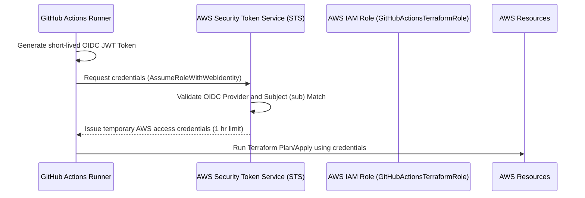
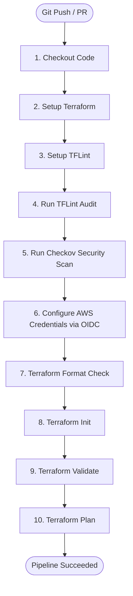

# Multi-Region AWS Infrastructure with Terraform & GitHub Actions CI/CD

An interview-ready, production-inspired Terraform codebase that provisions a secure, highly-available web application infrastructure on AWS. This repository demonstrates modern DevOps practices including GitOps CI/CD pipelines, OIDC federation, static code analysis (security/formatting), and multi-region network architectures.

---

## 🏗️ Architecture Overview

The infrastructure deploys a containerized web application tier using ECS on EC2, balanced with an Application Load Balancer, backed by a PostgreSQL database in RDS, and isolated within custom VPC subnets.

```mermaid
graph TD
    subgraph Primary Region: ap-south-1
        VPC_P["VPC (10.0.0.0/16)"]
        IGW_P["Internet Gateway"]
        NAT_P["NAT Gateway"]
        
        subgraph Public Subnets (A & B)
            ALB["Application Load Balancer (Port 80)"]
        end

        subgraph Private Subnets (A & B)
            ECS["ECS Service (EC2 Instances)"]
            RDS["PostgreSQL RDS Instance"]
        end
    end

    subgraph Secondary Region: us-east-1 (Failover Ready)
        VPC_S["VPC (172.16.0.0/16)"]
        IGW_S["Internet Gateway"]
        
        subgraph Public Subnets Secondary
            direction LR
            Sub_S1["Public Subnet 1"]
            Sub_S2["Public Subnet 2"]
        end
        
        subgraph Private Subnets Secondary
            direction LR
            Sub_S3["Private Subnet 1"]
            Sub_S4["Private Subnet 2"]
        end
    end

    ALB -->|Routes Traffic| ECS
    ECS -->|Connects| RDS
    VPC_P --- IGW_P
    VPC_P --- NAT_P
    VPC_S --- IGW_S
```

---

## 🔒 Security Architecture & OIDC flow

Instead of storing static AWS credentials in GitHub (which poses severe security risks), this repository uses **OpenID Connect (OIDC)** to dynamically assume temporary AWS IAM roles using short-lived JWT tokens.



### Key Security Implementations
1. **Zero Static Credentials**: Authentication to AWS is fully federated via OIDC.
2. **Automated Database Secrets**: Plaintext passwords are eliminated. A cryptographically secure password is dynamically generated by the `random_password` provider and stored directly in **AWS Secrets Manager**. The RDS PostgreSQL database retrieves this password dynamically via a `jsondecode()` lookup.
3. **Shift-Left Security Scanning**: Static analysis runs on every pull request using **Checkov** and **TFLint** to catch misconfigurations before deployment.

---

## 🌐 Multi-Region Strategy

The repository is structured to show multi-region deployment capacity using **Provider Aliases**:
* **Primary Region (`ap-south-1`)**: Deploys the full application stack (Networking, ALB, ECS, and RDS).
* **Secondary Region (`us-east-1`)**: Deploys a duplicated network topology (VPC, subnets, route tables). 
* **Cost Efficiency for Demos**: The secondary region is configured with `enable_nat_gateway = false`. This allows you to demonstrate cross-region provider orchestration without incurring the \$32/month AWS NAT Gateway charge in the backup region.

---

## 🚀 GitHub Actions CI/CD Pipeline Flow

The workflow is triggered on pushes and pull requests to the `main` branch:



---

## ⚙️ Configuration & Deploying

### 📂 Multi-Environment Structure
We manage environments using a unified codebase and separate `.tfvars` input files located in the `environments/` directory:

```
environments/
  ├── dev.tfvars   # Low-cost developer configurations (e.g. NAT Gateway disabled, 1 instance)
  ├── test.tfvars  # Staging size checks (NAT Gateway enabled, small instances)
  └── prod.tfvars  # High availability setup (NAT Gateway enabled, m5 database sizes)
```

### 🗃️ State Segregation (Terraform Workspaces)
To prevent environments from overwriting each other's state, use **Terraform Workspaces**. This prefixes S3 bucket keys automatically (e.g., `env:/dev/terraform-aws-multi-region/terraform.tfstate`).

To initialize and switch workspaces locally:
```bash
# 1. Initialize backend
terraform init

# 2. Create and switch to environment workspace
terraform workspace new dev   # (Only once)
terraform workspace select dev # (Subsequent runs)
```

### 📋 Running Environments Locally
Execute planning and validation checks passing the targeted environment variables file:

```bash
# Developer Sandbox (dev)
terraform plan -var-file="environments/dev.tfvars"

# Staging Environment (test)
terraform plan -var-file="environments/test.tfvars"

# Production Environment (prod)
terraform plan -var-file="environments/prod.tfvars"
```

### 🚀 Running Environments in CI
The GitHub Actions workflow supports:
1. **Automated Pull Requests**: Automatically runs format audits, TFLint check rules, Checkov static analysis scans, and planning dry-runs defaulting against the `dev` environment configurations.
2. **Manual Target Planning (`workflow_dispatch`)**: Triggered manually from the **Actions** tab of your repository. You can choose the targeted environment (`dev`, `test`, `prod`) from a drop-down menu parameters input before starting the validation runner.
